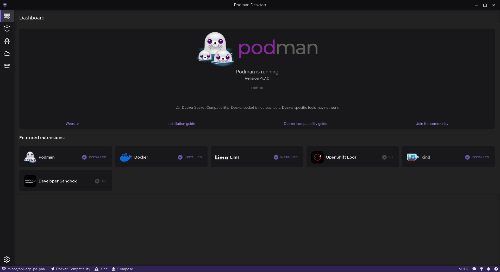

# Instalación

## paquetes

En fedora

```bash
sudo su -
dnf -y install flatpak podman jq
flatpak install flathub io.podman_desktop.PodmanDesktop
```

Con esto instalas Podman como engine de contenedores y Podman Desktop para tener una GUI agradable:


